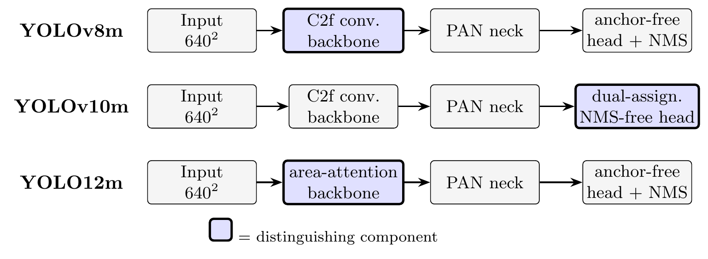
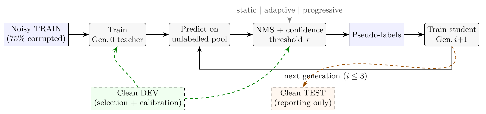
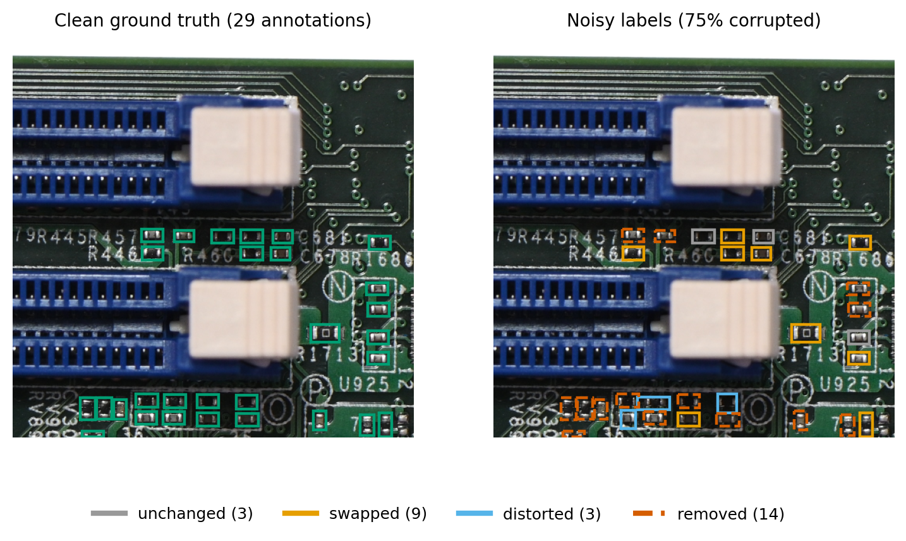
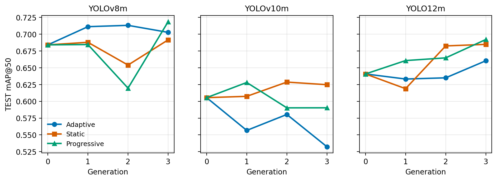
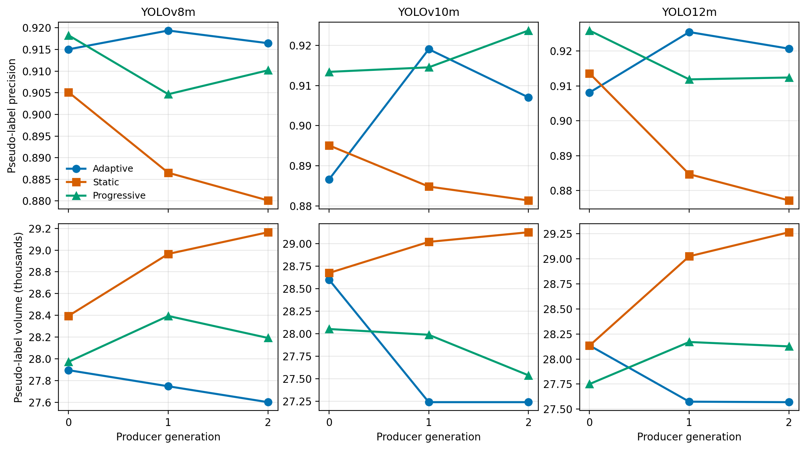
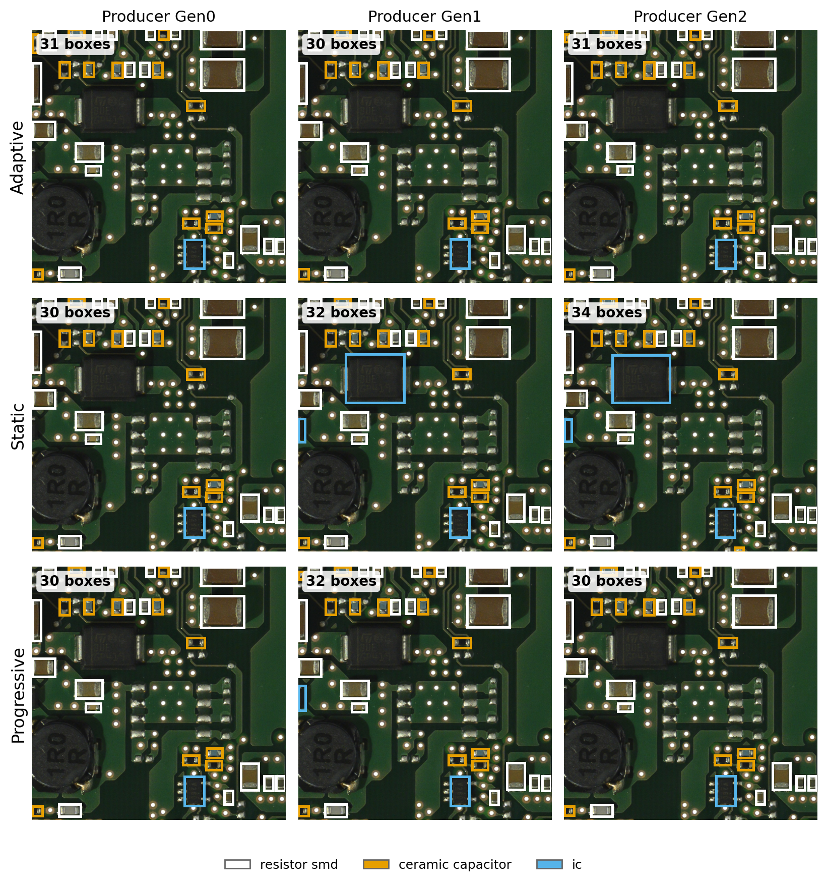
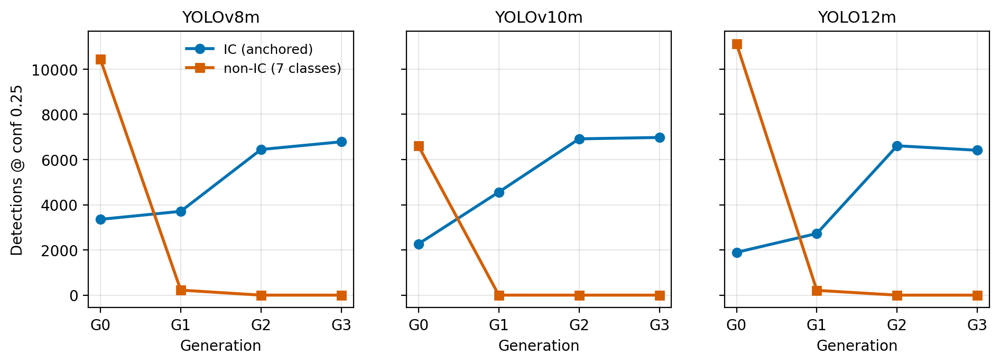
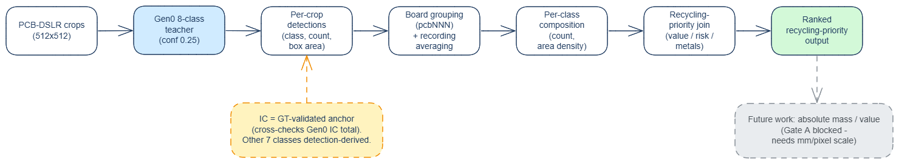
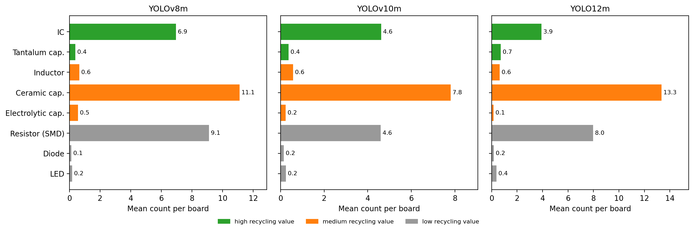

# Adaptive Confidence-Threshold Self-Labeling for Waste-PCB Detection

Semi-supervised object detection for **Waste Printed Circuit Board (WPCB)** component
recovery. The pipeline extends the GEN self-labeling method of Honorato et al. (2025)
with three **confidence-threshold strategies** for the self-training loop — *static*,
*adaptive* (per-class precision target), and *progressive* — and adds a downstream
**WPCB-EFAv2+** recycling-feasibility assessment. Three detectors are compared:
**YOLOv8m, YOLOv10m, YOLO12m**.

> **Status (v3, 2026-06):** all experiments are run, evaluated, and reported — noisy
> intra-FICS self-training (9 runs), PCB-DSLR cross-domain transfer, pseudo-label quality
> analysis, and the WPCB-EFAv2+ assessment. Both self-training loops run **Gen0 → Gen3**
> (3 student iterations). Canonical results live in `docs/experiment-log.md`, the generated
> tables under `paper/tables/`, and `results/v3/`. A manuscript for *Neural Computing &
> Applications* is in preparation and will be added here on publication.

## Reference

> Leandro Honorato de S. Silva et al., "GEN Self-Labeling Object Detector for PCB Recycling
> Evaluation," *IEEE Open Journal of the Computer Society*, vol. 6, 2025.
> DOI: [10.1109/OJCS.2025.3584297](https://doi.org/10.1109/OJCS.2025.3584297)

Honorato et al. define two experiments: a quantitative FICS-NOISE intra-dataset loop
(their Section 4.3) and a qualitative PCB-DSLR transfer loop (Section 4.4). This repository
reimplements both and extends them with the adaptive/progressive thresholds and the recycling
assessment.

## What this work adds

- **Three confidence-threshold strategies** for filtering pseudo-labels, compared head-to-head
  across three detector architectures on a heavily corrupted training set.
- **A leak-free evaluation protocol** — a board-grouped TRAIN/DEV/TEST split where adaptive
  threshold calibration and checkpoint selection happen on DEV, and **only TEST is ever reported**.
- **A pseudo-label quality analysis** that measures volume, precision, and noise recovery against
  the clean pre-corruption ground truth — surfacing strategy differences that aggregate mAP hides.
- **WPCB-EFAv2+**, a recycling-feasibility assessment that turns detections into a per-board
  component composition ranked by recycling value and risk.

---

## Method

### Detectors



The three detectors share an input, backbone, PAN neck, and detection head, differing in a
single distinguishing component: YOLOv8m's convolutional C2f backbone, YOLOv10m's NMS-free
dual-assignment head, and YOLO12m's area-attention backbone.

### Self-training loop



A Generation-0 teacher is trained on the noisy TRAIN split. Each generation predicts on the
unlabelled pool, filters detections through NMS and a confidence threshold τ, writes
pseudo-labels, and trains the next student — three iterations (Gen1–Gen3). The threshold τ is
where the three strategies differ:

| Strategy | τ behaviour |
|----------|-------------|
| **Static** | Fixed `conf_threshold = 0.25` every generation (Honorato's validated value). |
| **Adaptive** | Per-class threshold = lowest confidence at which the DEV precision curve reaches `target_precision = 0.9`, recomputed each generation. |
| **Progressive** | Scheduled ramp `0.35 → 0.45 → 0.55` across generations. |

The strategies are mutually exclusive. Calibration and `best.pt` selection use the clean,
board-disjoint **DEV** split; the clean **TEST** split is read only by the final evaluation.

### Label noise



75% of TRAIN annotations are corrupted (seed 42, non-overlapping) following the three-type
taxonomy of Freire et al. (2024): 25% class swap, 25% box distortion, 25% removal. DEV and TEST
remain clean in all conditions.

---

## Results

> **Reporting rule:** all metrics below are on the clean, board-disjoint **TEST** split (report on
> TEST, never DEV — the two splits rank generations in opposite orders). On held-out accuracy the
> strategies do not separate: the common classes are saturated near ceiling, the residual signal is
> dominated by rare-class variance, and the calibration (DEV) and reporting (TEST) splits give
> opposite Gen0-vs-student rankings. The dataset, not the extent of experimentation, bounds this
> comparison — a larger, less-saturated benchmark is the natural way to resolve whether the strategies
> separate on accuracy at all. The robust, **directional** finding is in the pseudo-label volume and
> precision dynamics; a second robust result is the cross-domain transfer recall gain below.

### Held-out TEST mAP@50 across generations



| Model | Strategy | Gen0 | Gen1 | Gen2 | Gen3 | Δ mAP50 (G3−G0) |
|-------|----------|:----:|:----:|:----:|:----:|:---------------:|
| YOLOv8m  | Adaptive    | 0.684 | 0.711 | 0.713 | 0.703 | +0.019 |
| YOLOv8m  | Static      | 0.684 | 0.688 | 0.654 | 0.692 | +0.007 |
| YOLOv8m  | Progressive | 0.684 | 0.685 | 0.620 | 0.719 | +0.034 |
| YOLOv10m | Adaptive    | 0.605 | 0.557 | 0.580 | 0.532 | −0.073 |
| YOLOv10m | Static      | 0.605 | 0.607 | 0.629 | 0.625 | +0.019 |
| YOLOv10m | Progressive | 0.605 | 0.628 | 0.590 | 0.590 | −0.015 |
| YOLO12m  | Adaptive    | 0.641 | 0.633 | 0.635 | 0.660 | +0.020 |
| YOLO12m  | Static      | 0.641 | 0.619 | 0.682 | 0.685 | +0.044 |
| YOLO12m  | Progressive | 0.641 | 0.661 | 0.665 | 0.692 | +0.051 |

The trajectories are small, non-monotonic, and inconsistent in order across architectures.
No strategy wins consistently (e.g. adaptive is best on nothing and regresses on YOLOv10m).
Source: `paper/tables/test_map_progression.tex` (generated from `results/v3/`).

### Pseudo-label dynamics (robust finding)



Measured against the clean pre-corruption ground truth, where the sample is large enough for
strategy differences to be visible. The pattern holds across **all three detectors**:

- **Static** inflates pseudo-label *volume* generation over generation while *precision decays*
  (−2.5 to −3.7 pp) — runaway annotation density.
- **Adaptive** trims volume and *holds precision*.
- Removal and class-swap corruptions are recovered ~99% by the loop (denoising); box-distortion
  recovery is lower (64–77%) and declines as localisation drifts.

The strategy panels below visualise the static-proliferation effect directly — pseudo-label box
count climbing across producer generations for the static threshold:



### PCB-DSLR cross-domain transfer (robust finding)



The FICS-noisy teacher is applied to the PCB-DSLR industrial domain, with IC ground truth merged
each generation (the only class with target-domain GT). The anchored IC class grows and its recall
against the partial ground truth rises sharply:

| Model | IC count Gen0 → Gen3 | Recall Gen0 → Gen3 | Recall gain |
|-------|:-------------------:|:------------------:|:-----------:|
| YOLOv8m  | 3,354 → 6,786 | 0.31 → 0.99 | 3.2× |
| YOLOv10m | 2,267 → 6,977 | 0.22 → 0.99 | 4.4× |
| YOLO12m  | 1,894 → 6,411 | 0.18 → 0.99 | 5.4× |

Every non-IC class collapses to zero by Generation 2 — a **structural** consequence of only IC
carrying target-domain GT (confirmed by a clean-teacher control and a support-base-retained "Path
A" variant, both of which collapse identically). The downstream assessment therefore uses the
**Gen0 teacher** as its multi-class assessor. Source: `paper/tables/dslr_ic_growth.tex`.

### WPCB-EFAv2+ recycling assessment



Detections from the Gen0 teacher are grouped per physical board, averaged over recordings, and
summarised as a per-class composition (count + per-crop area density) joined to a recycling
value/risk categorisation.



Absolute counts differ across detectors but the **recycling-priority ordering is identical**.
Composition for the YOLOv8m Gen0 teacher (`paper/tables/efa_composition.tex`):

| Component | Total | /board | Area dens. (%) | Value | Risk |
|-----------|:-----:|:------:|:--------------:|:-----:|:----:|
| IC | 743 | 6.94 | 7.33 | high | high |
| Tantalum cap. | 40 | 0.37 | 0.08 | high | medium |
| Inductor | 69 | 0.65 | 0.45 | medium | medium |
| Ceramic cap. | 1189 | 11.11 | 0.56 | medium | low |
| Electrolytic cap. | 58 | 0.55 | 0.29 | medium | high |
| Resistor (SMD) | 974 | 9.10 | 0.25 | low | medium |
| Diode | 13 | 0.12 | 0.05 | low | medium |
| LED | 18 | 0.17 | 0.09 | low | high |

---

## Repository structure

```
wpcb-threshold-strategies/
├── configs/            # Per-model YAML configs (base + self_train + noisy variants)
│   ├── yolov8/  yolov10/  yolo12/  rtdetr_l/  rtdetr_x/
│   └── split_manifest.json    # tracked record of the TRAIN/DEV/TEST board split
├── src/
│   ├── models/         # BaseDetector + YOLO/RT-DETR wrappers, MODEL_REGISTRY
│   ├── labeling/       # PseudoLabeler, SelfTrainer
│   └── utils/          # I/O, label analysis, precision-target thresholds, visualization
├── scripts/            # CLI entry points (train, self_train, evaluate, make_splits, …)
├── experiments/        # Launch scripts (run_<model>_noisy_*_v3.sh) and run logs (gitignored)
├── docs/               # Lab notebook, analyses, figures, methodology notes
├── paper/              # Result figures (PNG) and tables for the write-up (manuscript added on publication)
├── tests/              # Unit tests for label/utility helpers
└── data/               # External datasets via symlink (gitignored)
```

Large artifacts (images, `.pt` weights, `runs/`, `experiments/*/`, `results/`) are gitignored;
only source, configs, and the paper sources are tracked.

## Datasets

Both datasets live in `data/` (gitignored symlink to external storage) and are wired in by the
pipeline scripts.

| Dataset | Path | Role | Images | Classes |
|---------|------|------|--------|---------|
| FICS-PCB REMAP (augmented) | `data/FICS_PCB_REMAP_AUGUMENTED_1024_512_YOLO/` | Support (labeled) | 5,100 | 8 |
| PCB-DSLR crops | `data/PCB_DSLR_CROPS_512/` | Target (partially labeled) | 2,927 | ICs only |

### Train / DEV / TEST splits (leak-free calibration)

The clean FICS train set is partitioned at **s-number** (physical-board) granularity by
`scripts/make_splits.py`, so no board is shared across splits. Reproducible from
`data/split_manifest.json` (seeded, class-stratified).

| Split | Path | Labels | Images | Used for |
|-------|------|--------|:------:|----------|
| TRAIN | `data/FICS_PCB_REMAP_NOISE_TRAIN/` | noisy (25/25/25) | 3,324 | training only |
| DEV   | `data/dev/`  | clean | 870 | `best.pt` selection + adaptive precision-target calibration |
| TEST  | `data/test/` → `data/val/` | clean | 906 | final evaluation only |

### Classes (verified against Honorato Table 9 instance counts)

| ID | Name | ID | Name |
|----|------|----|------|
| 0 | `resistor_smd` | 4 | `inductor` |
| 1 | `ceramic_capacitor` | 5 | `electrolytic_capacitor` |
| 2 | `ic` | 6 | `tantalum_capacitor` |
| 3 | `diode` | 7 | `led` |

## Setup

Requires Python 3.12+ and an NVIDIA GPU with CUDA 12.x (tested: RTX 4060 8 GB).
Install [uv](https://docs.astral.sh/uv/), then sync (PyTorch cu124 wheels are pulled
automatically):

```bash
curl -LsSf https://astral.sh/uv/install.sh | sh
uv sync
```

All scripts run from the repo root with `PYTHONPATH=.`. Valid `--model` values everywhere:
`yolov8`, `yolov10`, `yolo12`, `rtdetr_l`, `rtdetr_x`.

## Reproduce

```bash
# 1. Build the board-grouped splits and the noisy TRAIN set
uv run python scripts/make_splits.py --seed 42
uv run python scripts/generate_noisy_dataset.py \
    --src-images data/train_clean/images --src-labels data/train_clean/labels \
    --output data/FICS_PCB_REMAP_NOISE_TRAIN \
    --classification-frac 0.25 --removal-frac 0.25 --distortion-frac 0.25 --seed 42

# 2. Train the Generation-0 teacher on the noisy TRAIN split
PYTHONPATH=. uv run python scripts/train.py --model yolov8 --config configs/yolov8/base_noisy.yaml

# 3. Run a self-training loop (Gen1–Gen3). Pre-built launchers handle iter1 seeding,
#    logging, and the correct config/output paths; run them in tmux. One GPU at a time.
bash experiments/run_yolov8_noisy_st_adaptive_v3.sh      # adaptive per-class threshold
bash experiments/run_yolov8_noisy_st_static_v3.sh        # static (conf = 0.25)
bash experiments/run_yolov8_noisy_st_progressive_v3.sh   # progressive (0.35 → 0.45 → 0.55)

# 4. Evaluate the final student on the held-out TEST split
PYTHONPATH=. uv run python scripts/evaluate.py --model yolov8 \
    --config configs/yolov8/base_noisy.yaml \
    --weights experiments/yolov8_st_noisy_adaptive_v3_42/iter3/train/weights/best.pt \
    --val-images data/test/images

# 5. PCB-DSLR detection-growth curve at fixed conf 0.25
PYTHONPATH=. uv run python scripts/evaluate_pcb_dslr.py --model yolov8 \
    --config configs/yolov8/self_train_dslr.yaml \
    --experiment experiments/yolov8_st_dslr_adaptive_v3_42 \
    --gen0-weights runs/yolov8/baseline_noisy_v3/weights/best.pt
```

Launcher naming convention: `experiments/run_<model>_noisy_st_{adaptive,static,progressive}_v3.sh`
for the three models. Crash recovery is automatic — re-running a launcher skips iterations that
already have a `best.pt`. `make help` lists Makefile shortcuts for the common single-model commands.

## Label format

YOLO format: one `.txt` per image, each line `class cx cy w h` (normalized). Image matching is
case-insensitive (`.jpg`/`.JPG`) — the dataset mixes cases from different capture sessions.

## Citation

This repository accompanies a manuscript under submission to *Neural Computing & Applications*
(manuscript sources will be added on publication). Until it appears, please cite the baseline method:

```bibtex
@article{honorato2025gen,
  title   = {GEN Self-Labeling Object Detector for PCB Recycling Evaluation},
  author  = {Silva, Leandro Honorato de S. and others},
  journal = {IEEE Open Journal of the Computer Society},
  volume  = {6},
  year    = {2025},
  doi     = {10.1109/OJCS.2025.3584297}
}
```
